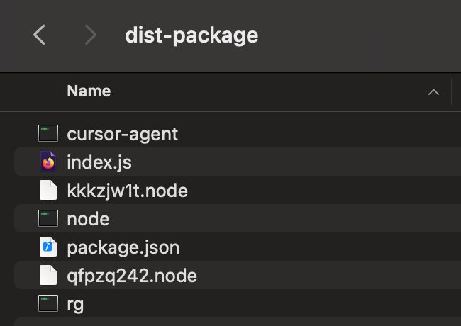
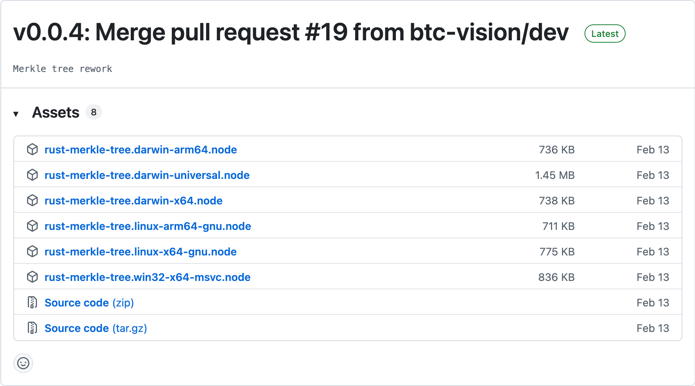
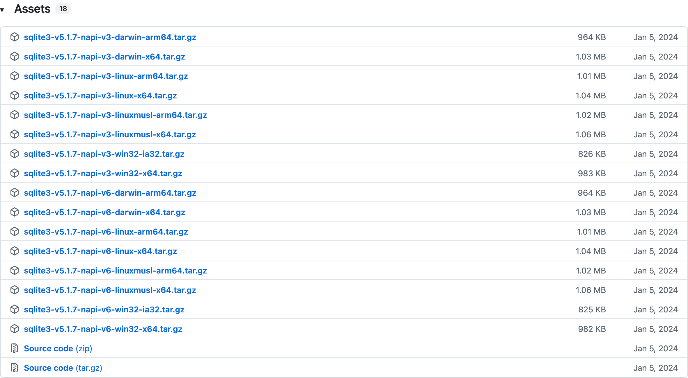

# Cursor Agent Windows

Cursor folks have recently released Cursor Agent CLI:
https://cursor.com/blog/cli

I am a big fan of TUIs for AI assistants as opposed to IDE forks a-al Cursor IDE
or even IDE integrations like the Claude Code VS Code extension.

As most developer tools today, Cursor Agent CLI ships for macOS and Linux first.
A Windows build I would expect to come later, but we do not have one yet.
The reason I expect this is because Claude Code followed the same trajectory
where Anthropic released macOS and Linux support first, followed by a Windows
native release a few months later.

I use macOS in my personal hobby development, but sometimes I work with Windows
machines as well and I was curious to see what it'd take to make Cursor Agent
run on Windows.

I already knew Claude Code was just a native build of a Node-based application
and I was reasonably confident Cursor Agent wasn't going to be any different.
This made me think making it run on Windows wouldn't be that difficult as likely
the only parts that would need adjustment would be dependencies that need to be
in their Windows version, the actual script comprising the TUI experience I
figured was already cross-platform on the account of it presumably being a Node
script.

I took a closer look at the command line in the announcement blog post:

```sh
curl https://cursor.com/install -fsSL | bash
```

Instead of piping to Bash, I piped it to `pbcopy` to paste it into my clipboard
and then I inspected the contents in VS Code.

I found this bit which is responsible for downloading the correct archive for
the current system and architecture:

```sh
# Detect OS
OS="$(uname -s)"
case "${OS}" in
    Linux*)     OS="linux";;
    Darwin*)    OS="darwin";;
    *)
        print_error "Unsupported operating system: ${OS}"
        exit 1
        ;;
esac

# Detect Architecture
ARCH="$(uname -m)"
case "${ARCH}" in
    x86_64|amd64)  ARCH="x64";;
    arm64|aarch64) ARCH="arm64";;
    *)
        print_error "Unsupported architecture: ${ARCH}"
        exit 1
        ;;
esac

# …

DOWNLOAD_URL="https://downloads.cursor.com/lab/2025.08.15-dbc8d73/${OS}/${ARCH}/agent-cli-package.tar.gz"
```

I constructed the macOS download URL manually:
https://downloads.cursor.com/lab/2025.08.15-dbc8d73/darwin/arm64/agent-cli-package.tar.gz

I downloaded the package and extracted its contents.
At this point I switched over to my Windows machine and moved the extracted
files there.

I opened the directory in VS Code and started inspecting.
As suspected, the Cursor Agent CLI is indeed a native build of a Node-based app
with some native Node modules as dependencies.

I was able to tell this from the file listing:


The `index.js` script is the actual implementation of the TUI and there are two
`.node` Node native modules.
We also see `rg` which is the RipGrep macOS build.

I haven't taken Claude Code apart, but I know it also uses RipGrep and I think I
remember reading something about an Anthropic engineer who worked on Claude Code
joining Cursor and presumably going onto to build the Cursor Agent application,
so I'd expect Claude Code looks very similar when taken apart like this.

I ran `node .` to run the `index.js` script.
Normally, I use Bun and while Bun AFAIK has native Node module loading support,
I wanted to be extra sure my choice of tooling won't affect the process here, so
I opted to use straight Node for this exercise.

I ran into a crash whose stack trace lead me to this code site:

```typescript
// ../merkle-tree/merkle-tree-napi.darwin-arm64.node
var require_merkle_tree_napi_darwin_arm64 = __commonJS((exports, module) => {
  module.exports = __require("./qfpzq242.node");
});
```

It looks like we're trying to load `qfpzq242.node` and the caller of this method
is this code site:

```typescript
// ../merkle-tree/native.js
var require_native = __commonJS((exports, module) => {
  var nativeBinding = null;
  var loadError = null;
  var { platform: platform3, arch } = process;
  try {
    if (platform3 === "darwin") {
      if (arch === "arm64") {
        nativeBinding = require_merkle_tree_napi_darwin_arm64();
      } else if (arch === "x64") {
        nativeBinding = (() => {
          throw new Error(
            "Cannot require module " + "./merkle-tree-napi.darwin-x64.node"
          );
        })();
      } else {
        throw new Error(`Unsupported macOS architecture: ${arch}`);
      }
    } else if (platform3 === "linux") {
      if (arch === "x64") {
        nativeBinding = (() => {
          throw new Error(
            "Cannot require module " + "./merkle-tree-napi.linux-x64-gnu.node"
          );
        })();
      } else if (arch === "arm64") {
        nativeBinding = (() => {
          throw new Error(
            "Cannot require module " + "./merkle-tree-napi.linux-arm64-gnu.node"
          );
        })();
      } else {
        throw new Error(`Unsupported Linux architecture: ${arch}`);
      }
    } else {
      throw new Error(`Unsupported platform: ${platform3}`);
    }
  } catch (err) {
    loadError = err;
  }
  if (!nativeBinding) {
    const expectedNames = {
      "darwin-arm64": "merkle-tree-napi.darwin-arm64.node",
      "darwin-x64": "merkle-tree-napi.darwin-x64.node",
      "linux-x64": "merkle-tree-napi.linux-x64-gnu.node",
      "linux-arm64": "merkle-tree-napi.linux-arm64-gnu.node",
    };
    const key = `${platform3}-${arch}`;
    const hint = expectedNames[key]
      ? ` (expected: ./${expectedNames[key]})`
      : "";
    const message = `Failed to load native binding for ${platform3}/${arch}${hint}
Original error: ${loadError && loadError.stack ? loadError.stack : loadError}`;
    throw new Error(message);
  }
  module.exports = nativeBinding;
  module.exports.MerkleClient = nativeBinding.MerkleClient;
  module.exports.MULTI_ROOT_ABSOLUTE_PATH =
    nativeBinding.MULTI_ROOT_ABSOLUTE_PATH;
});
```

Wanting to do a very minimal set of changes to the original script, I adjusted
the `else` branch to also call `require_merkle_tree_napi_darwin_arm64`:

```patch
     } else {
+       nativeBinding = require_merkle_tree_napi_darwin_arm64();
-       throw new Error(`Unsupported platform: ${platform3}`);
     }
```

I went hunting for what this package was and come across this NPM package:
https://www.npmjs.com/package/@btc-vision/rust-merkle-tree

The related repository lives here:
https://github.com/btc-vision/rust-merkle-tree

I took a look at its Releases section and what do you know - there is a Windows
Node module build just sitting there!

https://github.com/btc-vision/rust-merkle-tree/releases



I downloaded the binary for Windows and replaced `qfpzq242.node` with it.
Then I ran `node .` again and was elated to find we have a crash trying to load
a different Node module this time - meaning this replacement has worked!

The new module is at this code site:

```typescript
// ../../node_modules/.pnpm/sqlite3@5.1.7_patch_hash=wpoum7zjk6ojzyl25zadce3uda/node_modules/sqlite3/build/Release/node_sqlite3.node
var require_node_sqlite3 = __commonJS((exports, module) => {
  module.exports = __require("./kkkzjw1t.node");
});
```

Based on the comment left by the bundler, this is clearly SQLite 3, we don't
even need to go spelunking through the hexadecimal of the macOS Node module file
to try and find strings to help us identify or anything like that.

SQLite has an amazing website with great documentation and a top-notch Downloads
page, but unfortunately they do not publish their own Node module builds of
SQLite there.

I didn't want to burn too much time making my own build, so I went looking to
see if I could find an existing one.
A quick "sqlite3 windows node native module" Google search later, I found this
Google Groups thread: https://groups.google.com/g/nwjs-general/c/FVhjdoGXpZM.

It put me on https://github.com/TryGhost/node-sqlite3 where I found a Node build
of SQLite3 for Windows in the Releases section yet again.



I don't think this is the cleanest, if I were to do this for real, I would have
made my own SQLite3 build or used `prebuild-install` as per the `sqlite3` NPM
package readme here:
https://www.npmjs.com/package/sqlite3#prebuilt-binaries

However, this should do just fine for now, so let's find out…
I ran `node .` again.

At this point it was clear something went right, because the PowerShell terminal
lit up with the intro ASCII animation and then took me to the Cursor Agent login
flow.

I quit the process here because I knew I wasn't done yet, though.

The `rq` binary was still the macOS version so the moment I would ask the LLM in
Cursor Agent to do anything involving search, it would fail to spawn the `rg`
process.

I went to the RipGrep GitHub Releases and in the least surprising section of the
whole endeavour, I found a Windows build of it:

https://github.com/BurntSushi/ripgrep/releases

I had to go hunting for a prior release to the latest one, because that one had
only builds affected by the bugfix in it, but the prior one had the glorious
Windows build as expected:


I re-ran `node .` again, completed the Cursor Agent CLI login flow by following
the link it printed and signing in in the browser and from that point on, I was
off to the races.

I expected to see issues with the terminal formatting and TUI layout, but my
guess is Cursor Agent uses a library for managing this that has Windows support
built-in, so I did not find any issues in this area.

I should make it clear that while I only had to replace two native Node modules,
the actual script is bundled with many other dependencies baked in.
The external files are just Node modules with native code, not all Node packages
the script depends on.

The `index.js` file is sitting on 22 MB so there's a ton of stuff in there.

I found this to be a rather enjoyable exercise and I am glad I was able to get
Cursor Agent to run on Windows, but ultimately I don't think I can advise other
people to do it, unless they enjoy the hacky nature of this process.

A native Windows build is clearly not a technical hurdle seeing how little I had
to do to get oen made myself, so I'd expect Cursor folks to be able to add a
Windows-based pipeline dropping the Windows-native artifact in no time.

I hope they are able to prioritize this work so that Cursor Agent can be enjoyed
by Windows developers from the official source, soon.
